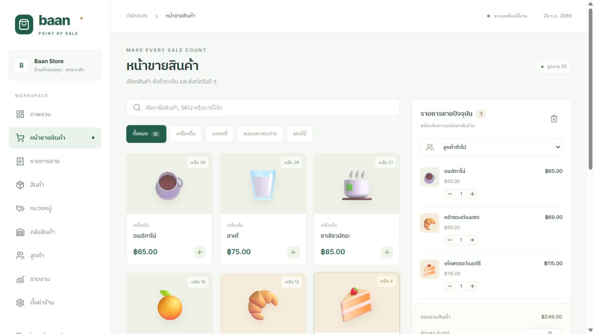
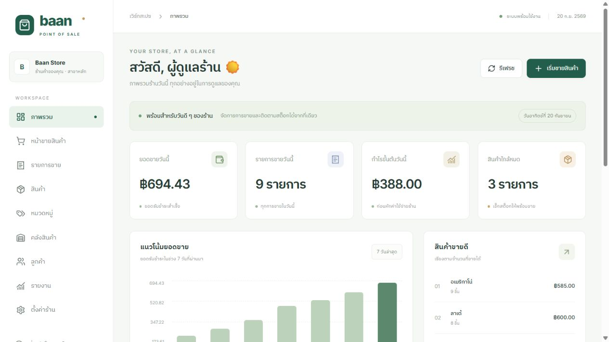
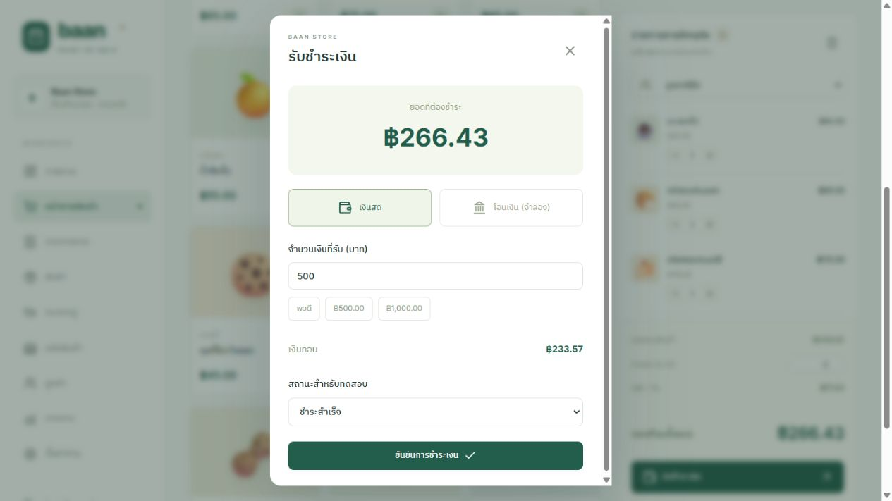
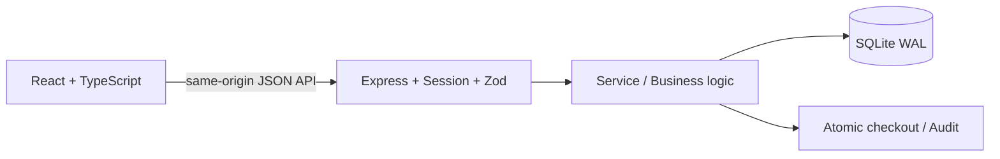

# Baan POS

**Full-Stack Point of Sale & Inventory Management System**

ระบบ POS Demo ภาษาไทยสำหรับร้านค้าสาขาเดียว พร้อมฐานข้อมูลจริง การจัดการสต็อก รายงาน และการชำระเงินจำลอง เหมาะสำหรับทดลองใช้งานและนำเสนอ Portfolio



[วิธีติดตั้ง](#ติดตั้งและเปิดใช้งาน) · [คู่มือใช้งาน](docs/user-guide.md) · [สถาปัตยกรรมและ API](docs/architecture.md) · [ภาพหน้าจอ](#ภาพหน้าจอ)

## ติดตั้งและเปิดใช้งาน

สิ่งที่ต้องมี: **Node.js 24 ขึ้นไป** (พร้อม npm) และ Git หากติดตั้งด้วยคำสั่ง clone

```bash
git clone https://github.com/twk56/baan-pos.git
cd baan-pos
npm ci
npm run build
npm start
```

เปิด **http://localhost:3000** ในเบราว์เซอร์ ฐานข้อมูลและบัญชีสาธิตจะสร้างอัตโนมัติเมื่อเปิดครั้งแรก กด `Ctrl+C` ใน terminal เพื่อหยุด server

**สำหรับ Windows:** หลัง clone หรือดาวน์โหลด ZIP แล้วแตกไฟล์ สามารถดับเบิลคลิก **Start-POS.cmd** ได้ ตัวเปิดโปรแกรมจะติดตั้ง dependencies และ build ถ้ายังไม่มี จากนั้นเปิด server แบบ background และเปิดเบราว์เซอร์ให้ ไม่ต้องติดตั้ง database server แยก

> Repository ไม่รวม `node_modules`, `dist`, ฐานข้อมูลร้าน, session หรือ log จึงต้องติดตั้งและ build ตามขั้นตอนข้างต้นเมื่อดาวน์โหลดไปเครื่องใหม่

## บัญชีทดลอง

| บัญชี | อีเมล | รหัสผ่าน |
|---|---|---|
| Admin | admin@demo.local | Demo@1234 |
| Cashier | cashier@demo.local | Demo@1234 |

รหัสผ่านเหล่านี้เป็นบัญชีสาธิตที่สร้างโดย seed เท่านั้น

## ทดลองขายครั้งแรก

1. เข้าสู่ระบบ → หน้าขายสินค้า → เลือกสินค้า
2. เลือกลูกค้าและส่วนลด → รับชำระเงิน
3. เงินสดระบุเงินรับ หรือเลือกโอนเงินจำลอง → ยืนยัน
4. ดูใบเสร็จ/พิมพ์ผ่านเบราว์เซอร์ ตรวจออเดอร์และ stock movement

ตัวอย่าง: เลือกอเมริกาโน่ 1 แก้ว ราคา 65 บาท ไม่มีส่วนลด VAT 7% เท่ากับ 4.55 บาท ยอดชำระ 69.55 บาท หากรับเงินสด 100 บาท ระบบแสดงเงินทอน 30.45 บาท เมื่อยืนยัน สต็อกลด 1 ชิ้น และมีรายการขาย/ใบเสร็จทันที

ดูขั้นตอนจัดการสินค้า รับสต็อก ลูกค้า ยกเลิกออเดอร์ และส่งออกรายงานใน [คู่มือใช้งานฉบับเต็ม](docs/user-guide.md)

## ภาพหน้าจอ

ภาพทั้งหมดถ่ายจากระบบที่ทำงานจริงด้วยฐานข้อมูลสาธิตแยกต่างหาก ยอดขายในภาพเป็นข้อมูลตัวอย่างสำหรับนำเสนอ ไม่ใช่ข้อมูลร้านของผู้ใช้ และไม่ได้ถูกเพิ่มในฐานข้อมูลเริ่มต้นเมื่อ clone

### ภาพรวมร้าน



### รับชำระเงิน



## ฟีเจอร์

- Login/logout, bcrypt password hashing, session 8 ชั่วโมงใน HttpOnly/SameSite cookie, rate limit เข้าสู่ระบบ
- Admin: Dashboard, POS, Products, Categories, Inventory, Orders, Customers, Reports, Settings, Users และ Audit log
- Cashier: POS, Orders และ Customers; API ไม่อนุญาตแก้สินค้า สต็อก สิทธิ์ หรือดูต้นทุน
- สินค้า: SKU/Barcode ไม่ซ้ำ ราคา/ต้นทุน หน่วยสตางค์ หมวดหมู่ สถานะ และสต็อกขั้นต่ำ
- สต็อก: รับเข้า ปรับเพิ่ม/ลด ป้องกันติดลบ ประวัติพร้อมผู้ดำเนินการ
- Checkout: ส่วนลดเป็นจำนวนบาท VAT บวกหลังส่วนลด ตรวจราคาปัจจุบันและสต็อกที่ server
- Payment simulation: cash/transfer, paid/pending/failed, เงินทอน และรับชำระ pending ภายหลัง
- Pending ตัดสต็อกเพื่อกันสินค้า; Failed ไม่สร้างออเดอร์; Cancel คืนสต็อกหนึ่งครั้งและเปลี่ยนสถานะเงินจำลอง
- คำขอชำระซ้ำด้วย request_key เดิมคืนออเดอร์เดิม ไม่ตัดสต็อกซ้ำ
- รายงานตามช่วงวัน/เดือน ช่องทางชำระ สินค้าขายดี และ CSV UTF-8 สำหรับ Excel
- หน้าร้าน ภาษาไทย รองรับจอเล็ก ใบเสร็จพิมพ์ผ่านเบราว์เซอร์

## Stack และสถาปัตยกรรม



Frontend: React, TypeScript, Vite, CSS, Lucide icons. Backend: Node.js 24, Express 5, Zod, bcryptjs. ฐานข้อมูล: SQLite แบบ persistent ผ่าน node:sqlite, foreign keys และ WAL เปิดใช้งาน

ใช้ SQLite เพื่อเปิดใช้ในเครื่องโดยไม่ต้องติดตั้ง database server สคีมาสร้างอัตโนมัติแบบ idempotent ใน `server/db.js` ยังไม่ได้ใช้ PostgreSQL/Prisma หรือ migration framework และไม่มีเว็บไซต์ Live Demo ที่ deploy ออนไลน์

## โครงสร้างโปรเจกต์

```text
baan-pos/
├── src/                  # React UI และ CSS
├── server/
│   ├── index.js          # API, session, role และ validation
│   ├── service.js        # Checkout, receipt และ cancel
│   └── db.js             # Database schema, transaction และ seed
├── tests/api.test.js     # API integration tests
├── docs/
│   ├── screenshots/      # ภาพหน้าจอระบบจริงด้วยข้อมูลสาธิต
│   ├── user-guide.md     # คู่มือใช้งานภาษาไทย
│   └── architecture.md   # Architecture, schema และ API
├── .env.example
├── Start-POS.cmd         # เปิดระบบบน Windows
└── package.json
```

## การพัฒนาและทดสอบ

```powershell
npm run build
npm test
```

ถ้าต้องการ Vite HMR ให้เปิด API ด้วย `npm start` และเปิด `npx vite` แยกอีก terminal (proxy `/api` ไป port 3000)

Tests ใช้ฐานข้อมูลชั่วคราวแยกที่ OS temp และ API port 3099 ครอบคลุม auth/role, ราคาทุน, checkout/tax/stock/payment, idempotency, failed payment, stale price, stock ไม่พอ, rollback จาก database failure, pending settlement, cancel, CRUD, reports และ logout

Environment variables: `PORT` (default 3000), `DB_PATH` (default `data/pos.sqlite`). ใช้ PowerShell `$env:PORT='3001'` หรือ Node `--env-file=.env`; ไม่มี secret ฝั่ง frontend

## จัดเก็บและสำรองข้อมูล

ข้อมูลจริงในเครื่องอยู่ที่ `data/pos.sqlite` และไฟล์ `-wal`/`-shm` ที่ SQLite จัดการ ห้ามลบไฟล์ขณะ server ทำงาน หากต้องการสำรอง ให้หยุด process ของ server นี้ก่อนแล้วสำรองโฟลเดอร์ `data` ทั้งหมด หรือใช้ SQLite online backup API

เซิร์ฟเวอร์ผูกกับ 127.0.0.1 ใช้งานได้บนเครื่องนี้เท่านั้น การปิดเบราว์เซอร์ไม่หยุด server; ใช้ Task Manager เพื่อหยุด Node process ของโปรเจกต์ หรือใช้ Ctrl+C หากเปิดผ่าน terminal

## ข้อจำกัดของ Demo

ไม่เชื่อม Payment Gateway, QR ธนาคาร, เครื่องพิมพ์, Barcode hardware, บัญชี/ภาษีตามกฎหมาย หรือหลายสาขา ปุ่มพิมพ์ใช้ browser print รายการขายย้อนหลังโหลดสูงสุด 1,000 รายการ, movement 500, audit 200; ยังไม่มี pagination ฐานข้อมูลไม่ใช่ PostgreSQL และตัวแอปยังไม่ได้ deploy ออนไลน์ (GitHub นี้เผยแพร่ source code)

บัญชีตัวอย่างและรหัสผ่านมีไว้สำหรับข้อมูลสาธิตในเครื่อง ก่อนนำไปเปิดบนอินเทอร์เน็ตต้องเตรียม TLS, บัญชีจริง, deployment configuration, backup policy และทดสอบโหลดตามการใช้งานจริง

ดูรายละเอียด [API, schema และ case study](docs/architecture.md) หรือ [คู่มือใช้งาน](docs/user-guide.md)
