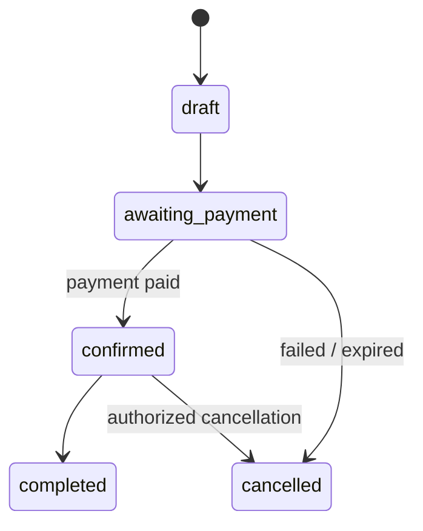
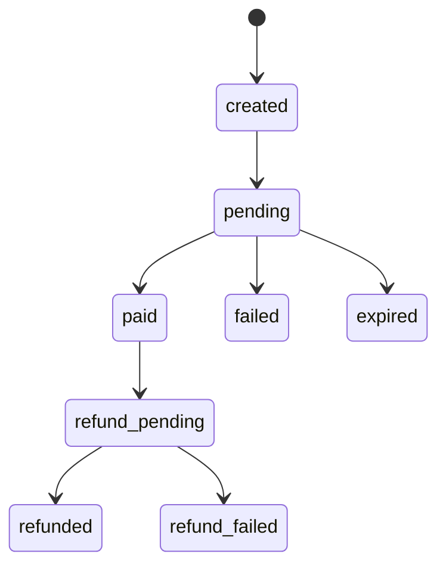
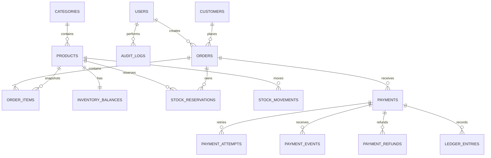
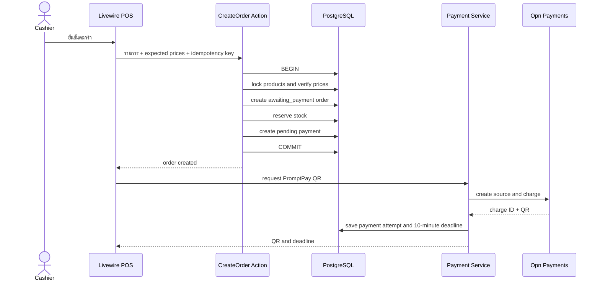
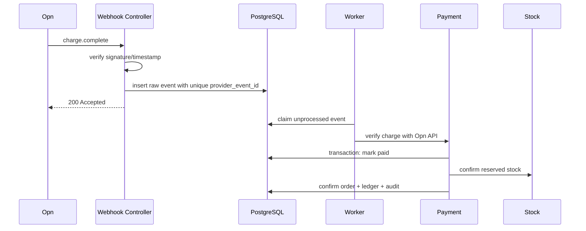

# Baan POS — Laravel Rebuild Blueprint

เอกสารนี้เป็นแบบก่อสร้างระบบ Baan POS ใหม่สำหรับร้านค้าปลีก **1 สาขา** โดยเน้นใช้งานง่าย แก้ไขง่าย และดูแลด้วยทีมขนาดเล็ก โครงสร้างเป็น Modular Monolith: แอป Laravel หนึ่งระบบ ฐานข้อมูลหนึ่งชุด และแยกโค้ดตามขอบเขตธุรกิจอย่างชัดเจน

## 1. Technology stack

| ส่วน | เทคโนโลยี | หน้าที่ |
|---|---|---|
| Backend | PHP 8.4 + Laravel | กฎธุรกิจ, transaction, authentication และ integrations |
| Frontend | Blade + Livewire | หน้าขายและหลังร้าน โดยไม่ต้องสร้าง SPA แยก |
| JavaScript | Alpine.js + JavaScript modules | barcode input, QR timer, printer และ browser APIs |
| Styling | Tailwind CSS | layout และ reusable UI styles |
| Database | PostgreSQL | orders, payments, inventory และ reports |
| Queue | Laravel database queue | webhook processing, reconciliation, exports และ notifications |
| Scheduler | Laravel Scheduler | reconciliation, expiry, backup check และ cleanup |
| Tests | Pest + Laravel HTTP tests + Playwright | unit, integration และ end-to-end |
| Storage | Cloudflare R2 | encrypted backup, exports และเอกสาร |
| Payment | Opn Payments adapter | PromptPay source/charge, webhook และ refund |
| Deployment | Docker + managed PostgreSQL | staging และ production |

ไม่ใช้ React, TypeScript, Redis, microservices หรือ Kubernetes ในรุ่นเริ่มต้น เพราะไม่จำเป็นสำหรับหนึ่งสาขา

## 2. System overview

```mermaid
flowchart LR
    USER[เจ้าของร้าน / แคชเชียร์] --> WEB[Blade + Livewire]
    SCANNER[Barcode scanner] --> JS[JavaScript modules]
    PRINTER[Thermal printer] <-- JS
    WEB <--> JS
    WEB --> APP[Laravel application]
    APP --> AUTH[Auth & Permission]
    APP --> SALES[Sales & Orders]
    APP --> STOCK[Inventory]
    APP --> PAYMENT[Payments]
    APP --> REPORT[Reports]
    APP --> DB[(PostgreSQL)]
    APP --> JOBS[(Database queue)]
    WORKER[Laravel queue worker] --> JOBS
    WORKER --> OPN[Opn Payments]
    OPN -->|Webhook| APP
    APP --> R2[Cloudflare R2]
```

## 3. Project directory

```text
baan-pos-laravel/
├── app/
│   ├── Domain/
│   │   ├── Auth/
│   │   ├── Catalog/
│   │   ├── Inventory/
│   │   ├── Customer/
│   │   ├── Sales/
│   │   ├── Payment/
│   │   ├── Receipt/
│   │   ├── Report/
│   │   ├── Setting/
│   │   └── Audit/
│   ├── Http/
│   │   ├── Controllers/
│   │   ├── Middleware/
│   │   └── Requests/
│   ├── Livewire/
│   │   ├── Pos/
│   │   ├── Orders/
│   │   ├── Products/
│   │   ├── Inventory/
│   │   ├── Customers/
│   │   ├── Reports/
│   │   └── Settings/
│   ├── Jobs/
│   ├── Console/Commands/
│   ├── Policies/
│   └── Providers/
├── database/
│   ├── migrations/
│   ├── factories/
│   └── seeders/
├── resources/
│   ├── views/
│   │   ├── layouts/
│   │   ├── components/
│   │   ├── livewire/
│   │   └── receipts/
│   ├── js/
│   │   ├── app.js
│   │   ├── barcode-scanner.js
│   │   ├── promptpay-timer.js
│   │   ├── receipt-printer.js
│   │   └── network-status.js
│   └── css/app.css
├── routes/
│   ├── web.php
│   ├── api.php
│   ├── webhooks.php
│   └── console.php
├── tests/
│   ├── Unit/
│   ├── Feature/
│   └── Browser/
├── config/
│   ├── payments.php
│   ├── pos.php
│   └── backup.php
├── docker/
├── composer.json
└── package.json
```

## 4. Module rule

แต่ละโมดูลมีรูปแบบเดียวกันเพื่อให้ค้นหาและแก้ไขง่าย

```text
app/Domain/Payment/
├── Actions/                 # งานหนึ่งคำสั่ง เช่น CreatePromptPayCharge
├── Data/                    # DTO สำหรับส่งข้อมูลภายใน
├── Enums/                   # PaymentStatus และ PaymentMethod
├── Events/                  # PaymentPaid, PaymentExpired
├── Exceptions/
├── Models/
├── Services/                # PaymentService และ ReconciliationService
├── Providers/               # OpnPaymentGateway
└── Tests/
```

กฎการเรียกใช้งาน:

```text
Livewire/Controller
        ↓
Form Request / Validation
        ↓
Action หรือ Domain Service
        ↓
Eloquent Model / Provider
        ↓
PostgreSQL / External service
```

- Livewire และ Controller ห้ามมี SQL หรือกฎธุรกิจหลัก
- Model เก็บ relationship, casts และ query scopes ที่สั้น
- Action ทำงานหนึ่งเรื่องและเปิด transaction เมื่อมีหลายตาราง
- Provider เป็นจุดเดียวที่ติดต่อ Opn, R2 หรือระบบภายนอก
- ทุกจำนวนเงินเก็บเป็นจำนวนเต็มหน่วยสตางค์

## 5. Main modules

### 5.1 Auth and users

โมดูลหลัก: การเข้าสู่ระบบ สิทธิ์ และ session

โมดูลย่อย:

- Login/logout
- Password hashing
- Session expiration
- Roles: `owner`, `manager`, `cashier`
- Authorization policies
- Login audit

ตาราง: `users`, `sessions`, `audit_logs`

### 5.2 Catalog

โมดูลหลัก: ข้อมูลสินค้าที่นำไปขาย

โมดูลย่อย:

- Products
- Categories
- SKU
- Barcode
- Cost and sale price
- Product status
- Product image

ตาราง: `products`, `categories`

### 5.3 Inventory

โมดูลหลัก: ความถูกต้องของจำนวนสินค้า

โมดูลย่อย:

- Stock on hand
- Stock reservation
- Receiving
- Adjustment
- Sale deduction
- Reservation release
- Movement history
- Low-stock alert

ตาราง: `inventory_balances`, `stock_reservations`, `stock_movements`

```text
available = on_hand - reserved
```

ห้ามแก้ `on_hand` โดยตรง ทุกการเปลี่ยนต้องผ่าน Inventory service และสร้าง stock movement

### 5.4 Customers

โมดูลหลัก: ข้อมูลและประวัติลูกค้า

โมดูลย่อย:

- Customer profile
- Purchase history
- Data export
- Anonymization/delete request
- Retention status

ตาราง: `customers`, `privacy_requests`

### 5.5 Sales and orders

โมดูลหลัก: ตะกร้า การคำนวณ และวงจรออเดอร์

โมดูลย่อย:

- Cart calculation
- Server-side price validation
- Discount
- Tax calculation
- Order creation
- Order items
- Order cancellation
- Idempotency
- Receipt eligibility

ตาราง: `orders`, `order_items`, `idempotency_keys`

สถานะออเดอร์:



### 5.6 Payments

โมดูลหลัก: เงินสด PromptPay และการตรวจยอดกับผู้ให้บริการ

โมดูลย่อย:

- Payment attempt
- Cash payment
- PromptPay source/charge
- QR expiry
- Webhook inbox
- Idempotent event processing
- Status reconciliation
- Late payment handling
- Refund
- Settlement comparison
- Immutable ledger

ตาราง:

- `payments`
- `payment_attempts`
- `payment_events`
- `payment_refunds`
- `payment_settlements`
- `ledger_entries`

สถานะ payment:



### 5.7 Receipts and tax

โมดูลหลัก: เอกสารหลังชำระเงิน

โมดูลย่อย:

- Receipt number sequence
- Receipt rendering
- Thermal print view
- Reprint audit
- Tax invoice placeholder
- Credit/debit note placeholder

ใบเสร็จสร้างได้เมื่อ payment เป็น `paid` เท่านั้น ระบบห้ามเรียกเอกสารว่าใบกำกับภาษีจนกว่าผู้เชี่ยวชาญภาษีไทยตรวจรับ

### 5.8 Reports

โมดูลหลัก: รายงานจากข้อมูลที่ชำระสำเร็จ

โมดูลย่อย:

- Daily sales
- Payment method summary
- Product ranking
- Gross profit
- Inventory movement
- Settlement mismatch
- CSV/XLSX export

รายงานยอดขายต้องเลือกเฉพาะ order ที่ยืนยันแล้วและ payment ที่ paid

### 5.9 Settings and audit

โมดูลย่อย:

- Store profile
- VAT configuration
- Receipt footer
- Payment configuration
- Printer preferences
- Audit log
- Data retention settings

Secret keys เก็บใน environment/secret manager เท่านั้น ห้ามเก็บในฐานข้อมูลแบบข้อความปกติ

## 6. JavaScript responsibilities

JavaScript ใช้เฉพาะงานที่ต้องทำใน browser:

| Module | หน้าที่ |
|---|---|
| `barcode-scanner.js` | รับ keyboard buffer จาก scanner, ตรวจ Enter และส่ง barcode ให้ Livewire |
| `promptpay-timer.js` | แสดงเวลานับถอยหลัง 10 นาทีและซ่อน QR เมื่อหมดเวลา |
| `receipt-printer.js` | เปิด print view และควบคุม browser print |
| `network-status.js` | แสดง online/offline และป้องกัน PromptPay ขณะ offline |

JavaScript ห้ามตัดสินว่า payment สำเร็จ ห้ามคำนวณยอดสุดท้าย และห้ามแก้สต็อก ความจริงทั้งหมดต้องยืนยันจาก Laravel และ PostgreSQL

## 7. Database overview



ข้อบังคับฐานข้อมูล:

- ใช้ foreign keys ทุกความสัมพันธ์สำคัญ
- ใช้ `bigint` สำหรับเงินหน่วยสตางค์
- ใช้ `numeric` เฉพาะอัตราภาษี
- ใช้ `timestamptz` และแสดงผลเขตเวลา Asia/Bangkok
- ใช้ unique constraint กับ order number, receipt number, idempotency key และ provider event ID
- ใช้ check constraint ป้องกันเงินติดลบและสถานะที่ไม่รองรับ
- ห้าม hard delete orders, payments, ledger และ stock movements

## 8. Checkout transaction



หากสร้าง charge ไม่สำเร็จ ระบบต้องทำ payment attempt เป็น failed และปล่อย stock reservation หรือให้ผู้ใช้ลองสร้าง payment attempt ใหม่กับออเดอร์เดิม

## 9. Webhook processing



Webhook endpoint ตอบเร็ว งานธุรกิจทำใน queue และ event ซ้ำต้องคืนผลสำเร็จโดยไม่บันทึกเงินหรือสต็อกซ้ำ

## 10. Routes

### Web routes

```text
/login
/pos
/orders
/orders/{order}
/products
/inventory
/customers
/reports
/settings
```

### API routes ที่จำเป็น

```text
POST /api/payments/{order}/promptpay
GET  /api/payments/{payment}/status
POST /webhooks/opn
GET  /healthz
GET  /readyz
```

ไม่ต้องสร้าง REST API สำหรับทุกหน้าจอ Livewire ติดต่อ Laravel โดยตรง ส่วน public API ให้เพิ่มเมื่อมี mobile app หรือ integration จริง

## 11. Scheduler and queue

| Job | ความถี่ |
|---|---|
| Expire pending QR | ทุก 1 นาที |
| Reconcile pending payments | ทุก 5 นาที |
| Compare settlements | ทุกวัน |
| Backup verification | ทุกวันหลัง backup |
| Remove expired sessions/jobs | ทุกวัน |
| Retention cleanup | ตาม policy |

Production แยก process เป็น `web`, `queue-worker` และ `scheduler` แต่ใช้ codebase และฐานข้อมูลเดียวกัน

## 12. Security baseline

- Laravel session cookie: HttpOnly, Secure, SameSite=Lax/Strict ตาม payment flow
- CSRF protection ทุก form และ Livewire request
- Rate limit login, QR creation และ webhook
- Password ใช้ Argon2id
- ตรวจ role ผ่าน Policies ไม่ซ่อนเฉพาะปุ่มหน้าเว็บ
- Webhook ตรวจ signature, timestamp และดึง charge ยืนยันผ่าน Opn API
- เก็บ secrets ใน environment/secret manager
- Audit login, price change, stock adjustment, cancellation, refund และ reprint
- Dependency scan ทั้ง Composer และ npm
- HTTPS เท่านั้นใน staging/production
- Backup เข้ารหัสและทดสอบ restore ลงฐานแยก

## 13. Development order

### Phase 1 — Foundation

1. Laravel project, PostgreSQL และ Docker
2. Authentication, roles และ policies
3. Base layout, UI components และ audit log
4. CI: format, static analysis, tests และ dependency scan

### Phase 2 — Core POS

1. Catalog
2. Inventory balance and movement
3. Customers
4. Cart and order transaction
5. Cash payment and receipt

### Phase 3 — PromptPay

1. Payment attempts and provider adapter
2. QR display and 10-minute application deadline
3. Webhook inbox and idempotency
4. Reconciliation and late-payment handling
5. Refund and settlement report

### Phase 4 — Operations

1. Reports and exports
2. Barcode workflow
3. Thermal print templates
4. R2 backup and restore drill
5. Monitoring and alerts

### Phase 5 — Pilot

1. Test with selected scanner/printer models
2. Run PromptPay test flows
3. Conduct security review
4. Obtain Thai tax/PDPA review
5. Pilot at one branch with incident log and daily reconciliation

## 14. Definition of done

ระบบพร้อม Pilot เมื่อ:

- Cash sale และ PromptPay ไม่สร้าง paid order ก่อนยืนยันเงินจริง
- Webhook ซ้ำหรือมาผิดลำดับไม่ทำยอดหรือสต็อกซ้ำ
- QR pending, paid, failed, expired และ late-payment ผ่าน E2E tests
- สต็อกไม่ติดลบภายใต้การขายพร้อมกัน
- Receipt ไม่ออกก่อน payment paid
- Restore backup ล่าสุดลงฐานแยกและตรวจยอดได้
- Owner, manager และ cashier ผ่าน permission tests
- Scanner และ printer รุ่นที่รองรับผ่านการทดสอบหน้างาน
- มีรายงาน reconciliation ที่ยอดตรงกับ Opn
- ผู้เชี่ยวชาญตรวจข้อความภาษีและ PDPA ก่อนเปิดใช้กับลูกค้าจริง

## 15. Scope boundary

รุ่นแรกออกแบบสำหรับร้านเดียว หนึ่งสาขา และฐานข้อมูลเดียว จึงยังไม่เพิ่ม `tenant_id`, subscription billing หรือ multi-region infrastructure หากจะขยายเป็น SaaS หลายร้าน ให้เพิ่ม tenant boundary หลังระบบหนึ่งสาขาผ่าน Pilot และ business workflow นิ่งแล้ว

