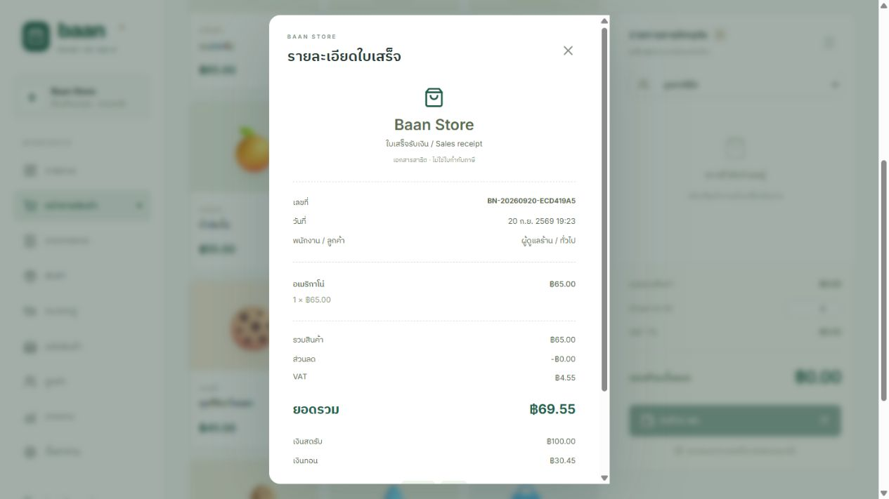

# คู่มือใช้งาน Baan POS

## 1. ติดตั้งและเปิดระบบ

ติดตั้ง Node.js 24 ขึ้นไป แล้ว clone repository หรือใช้ปุ่ม **Code → Download ZIP** บน GitHub และแตกไฟล์

```bash
git clone https://github.com/twk56/baan-pos.git
cd baan-pos
npm ci
npm run build
npm start
```

เปิด http://localhost:3000 ระบบสร้างสินค้าเริ่มต้น 12 รายการ หมวดหมู่ 4 กลุ่ม ลูกค้าตัวอย่าง และบัญชีทดลองให้โดยอัตโนมัติ ฐานข้อมูลเริ่มต้นไม่มีประวัติยอดขาย ข้อมูลจะยังอยู่หลังปิดและเปิดระบบใหม่

บน Windows ใช้ **Start-POS.cmd** แทนการพิมพ์คำสั่งได้ หากไม่เคยติดตั้ง dependencies ตัวเปิดโปรแกรมจะติดตั้งให้ก่อนใช้งาน

## 2. เข้าสู่ระบบ

| บทบาท | อีเมล | รหัสผ่าน | สิทธิ์หลัก |
|---|---|---|---|
| Admin | `admin@demo.local` | `Demo@1234` | จัดการร้านทุกเมนู |
| Cashier | `cashier@demo.local` | `Demo@1234` | ขายสินค้า ดูออเดอร์ รับชำระ และจัดการลูกค้า |

Session มีอายุ 8 ชั่วโมง กดปุ่มออกจากระบบท้ายเมนูด้านซ้ายเพื่อจบ session บนหน้าจอขนาดเล็ก กดไอคอนเมนูมุมซ้ายบนเพื่อเปิดเมนูหลัก

## 3. ขายสินค้าและรับชำระ

1. เลือก **หน้าขายสินค้า**
2. ค้นหาชื่อสินค้า, SKU หรือบาร์โค้ด หรือเลือกหมวดหมู่
3. คลิกการ์ดสินค้าเพื่อเพิ่มตะกร้า ใช้ปุ่ม `+` / `−` เพื่อปรับจำนวน
4. เลือกลูกค้า หากไม่เลือก ระบบบันทึกเป็นลูกค้าทั่วไป
5. ระบุส่วนลดเป็นจำนวนบาทตามต้องการ ระบบบวก VAT หลังหักส่วนลด
6. กด **รับชำระเงิน** แล้วเลือกเงินสดหรือโอนเงินจำลอง
7. เงินสดให้ระบุเงินรับ หรือเลือกปุ่มจำนวนเงินสำเร็จรูปเพื่อดูเงินทอน
8. เลือก **ชำระสำเร็จ** แล้วกด **ยืนยันการชำระเงิน**
9. ใบเสร็จจะแสดงหลังบันทึกสำเร็จ กด **พิมพ์ใบเสร็จ** เพื่อเปิดหน้าพิมพ์ของเบราว์เซอร์


ระบบคำนวณราคาและตรวจสต็อกที่ server อีกครั้ง หากสินค้าไม่พอหรือราคาเปลี่ยน ระบบปฏิเสธรายการพร้อมข้อความอธิบาย หากเปลี่ยนราคาสินค้าระหว่างเปิดตะกร้า ให้โหลดหน้าขายใหม่และเลือกสินค้าอีกครั้ง

### สถานะชำระเงินสำหรับสาธิต

| สถานะ | ผลลัพธ์ |
|---|---|
| ชำระสำเร็จ | สร้างออเดอร์ บันทึกการชำระ และตัดสต็อก |
| รอชำระ | สร้างออเดอร์และตัดสต็อกเพื่อกันสินค้า แต่ยังไม่รวมในยอดขายที่รับชำระแล้ว |
| จำลองการชำระล้มเหลว | ไม่สร้างออเดอร์และไม่ตัดสต็อก |


หลังยืนยัน ระบบเปิดใบเสร็จพร้อมเลขรายการ รายการสินค้า VAT ยอดรวม เงินสดรับ และเงินทอน สามารถกดพิมพ์ใบเสร็จจากหน้าต่างนี้ได้



การโอนเงินและคืนเงินในระบบเป็นการจำลอง ไม่มีการส่งเงินจริง

## 4. รายการขายและยกเลิก

เปิด **รายการขาย** ค้นหาเลขรายการหรือลูกค้า และกรองสถานะได้ คลิกแถวเพื่อเปิดรายละเอียดหรือใบเสร็จ

- ออเดอร์ที่รอชำระ: กด **รับชำระเงิน** เพื่อบันทึกยอดที่ได้รับ
- Admin ยกเลิกออเดอร์: กด **ยกเลิก / คืนเงิน** แล้วยืนยัน ระบบคืนสต็อกและเก็บประวัติ
- ออเดอร์ที่ยกเลิกแล้วจะไม่ถูกนับในรายงานยอดขาย และไม่สามารถคืนสต็อกซ้ำจากออเดอร์เดิม

Cashier ไม่มีสิทธิ์ยกเลิกออเดอร์

## 5. สินค้าและหมวดหมู่

Admin เปิด **หมวดหมู่ → เพิ่มหมวดหมู่** เพื่อจัดกลุ่มสินค้า จากนั้นเปิด **สินค้า → เพิ่มสินค้า** และระบุชื่อ SKU หมวดหมู่ ราคาขาย ต้นทุน และสต็อกขั้นต่ำ บาร์โค้ดเป็นข้อมูลเสริม

SKU และบาร์โค้ดต้องไม่ซ้ำกับสินค้าที่มีอยู่ สินค้าใหม่เริ่มที่สต็อก 0 ให้รับเข้าผ่านเมนูคลังสินค้า สัญลักษณ์บนการ์ดสินค้าใช้ช่องอีโมจิ

กดไอคอนดินสอเพื่อแก้ข้อมูลสินค้า การตั้งสถานะ **ปิดใช้งาน** ทำให้สินค้าไม่ปรากฏในหน้าขาย โดยยังเก็บประวัติรายการเดิม

## 6. คลังสินค้า

Admin เปิด **คลังสินค้า** เพื่อตรวจจำนวนคงเหลือ กรองเฉพาะสินค้าใกล้หมด หรือเปิดแท็บ **ประวัติความเคลื่อนไหว**

- **รับสินค้าเข้า**: เลือกสินค้า ระบุจำนวนบวก และหมายเหตุ
- **ปรับยอดสต็อก**: ระบุจำนวนที่เพิ่มหรือลด เช่น `5` คือเพิ่ม 5 ชิ้น และ `-2` คือลด 2 ชิ้น พร้อมเหตุผล
- จำนวนที่กรอกเป็นผลต่าง ไม่ใช่ยอดคงเหลือใหม่ ระบบไม่ยอมให้ยอดรวมติดลบ

การขาย รับเข้า ปรับยอด และยกเลิกออเดอร์มี stock movement พร้อมวันเวลาและผู้ทำรายการ

## 7. ลูกค้า

เปิด **ลูกค้า → เพิ่มลูกค้า** เพื่อบันทึกชื่อ เบอร์โทร และอีเมล เลือกลูกค้าระหว่างขายเพื่อเชื่อมประวัติการซื้อ คลิกชื่อลูกค้าเพื่อดูออเดอร์ที่เกี่ยวข้อง

## 8. ภาพรวมและรายงาน

Admin ดู **ภาพรวม** เพื่อเช็กยอดขายวันนี้ จำนวนออเดอร์ กำไรขั้นต้น สินค้าใกล้หมด แนวโน้ม 7 วัน และสินค้าขายดี


เปิด **รายงาน** และเลือกช่วงวัน หรือกด **วันนี้ / เดือนนี้** เพื่อดูยอดรวม รายวัน ช่องทางชำระ และสินค้าขายดีในช่วงที่เลือก กด **ส่งออก CSV** เพื่อนำข้อมูลไปเปิดใน Excel

รายงานนับเฉพาะออเดอร์ที่ชำระสำเร็จและยังไม่ยกเลิก ใช้วันตามเวลาไทย VAT เป็นยอดบวกหลังส่วนลด ส่วนกำไรขั้นต้นหักต้นทุนสินค้าและส่วนลด แต่ยังไม่หักค่าใช้จ่ายอื่นของร้าน

## 9. ตั้งค่าร้านและผู้ใช้

Admin เปิด **ตั้งค่าร้าน** เพื่อแก้ชื่อร้าน อัตรา VAT และข้อความท้ายใบเสร็จ เพิ่มผู้ใช้ และกำหนดสิทธิ์ Admin/Cashier ระบบไม่อนุญาตให้ผู้ดูแลเปลี่ยนสิทธิ์ของบัญชีที่กำลังใช้งานอยู่

ส่วน **บันทึกการทำงาน** แสดงการขาย การยกเลิก การแก้สินค้า การปรับสต็อก และการเปลี่ยนสิทธิ์ผู้ใช้ล่าสุด

## 10. ปิดระบบและสำรองข้อมูล

ถ้าเปิดผ่าน `npm start` ให้กด `Ctrl+C` ใน terminal ถ้าเปิดผ่านไฟล์ดับเบิลคลิก server จะทำงานแบบ background ให้หยุดเฉพาะ Node process ของโปรเจกต์นี้เมื่อต้องการปิด server

ข้อมูลอยู่ใน `data/pos.sqlite` และไฟล์ประกอบของ SQLite หากสำรองด้วยการคัดลอกไฟล์ ให้หยุด server ก่อนแล้วคัดลอกโฟลเดอร์ `data` ทั้งหมด ห้ามลบฐานข้อมูลเพื่อแก้ปัญหาโดยไม่สำรอง

## ปัญหาที่พบบ่อย

| อาการ | วิธีตรวจสอบ |
|---|---|
| ไม่พบคำสั่ง `node` หรือ `npm` | ติดตั้ง Node.js 24 ขึ้นไป แล้วเปิด terminal ใหม่ |
| เปิด localhost ไม่ได้ | ตรวจว่า server ทำงานอยู่ และใช้ port ที่ตั้งไว้ |
| Port 3000 ถูกใช้แล้ว | เปิดระบบเดิม หรือเปลี่ยน port ก่อนรัน เช่น PowerShell `$env:PORT='3001'` แล้ว `npm start` |
| หน้าเดิมหลังแก้โค้ด | รัน `npm run build` แล้วรีเฟรชเบราว์เซอร์; ถ้าแก้ server ให้เริ่ม process ใหม่ด้วย |
| เข้าระบบไม่ได้ | ตรวจอีเมลและรหัสผ่านตัวอย่าง และสถานะบัญชี |
| ขายไม่ได้เพราะสต็อกไม่พอ | ให้ Admin รับสินค้าเข้าหรือเลือกจำนวนที่มีจริง |
| ถูกจำกัดการ Login | รอ 10 นาทีหลังพยายามเข้าระบบผิดหลายครั้ง |

ดู log ของตัวเปิด Windows ได้ที่ `server.log` และ `server-error.log`
